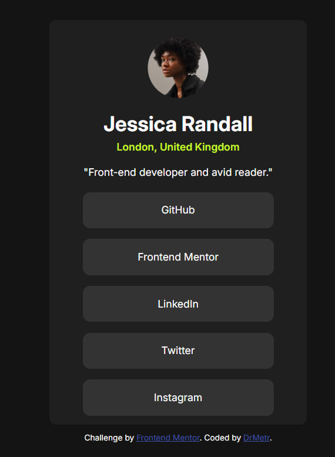
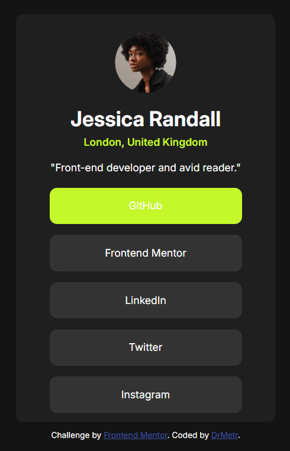
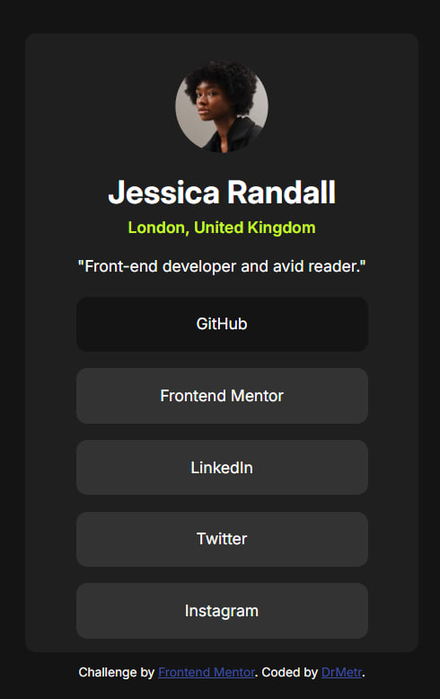

# Frontend Mentor - Social links profile solution

This is a solution to the [Social links profile challenge on Frontend Mentor](https://www.frontendmentor.io/challenges/social-links-profile-UG32l9m6dQ). Frontend Mentor challenges help you improve your coding skills by building realistic projects. 

## Table of contents

- [Overview](#overview)
  - [The challenge](#the-challenge)
  - [Screenshot](#screenshot)
  - [Links](#links)
- [My process](#my-process)
  - [Built with](#built-with)
  - [What I learned](#what-i-learned)
  - [Continued development](#continued-development)
- [Author](#author)

## Overview

### The challenge

Users should be able to:

- See hover and focus states for all interactive elements on the page

### Screenshot





### Links

- Solution URL: [https://github.com/DrMetr/Social-links-profile-challenge](https://github.com/DrMetr/Social-links-profile-challenge)
- Live Site URL: [file:///C:/Users/Metronome/Documents/GitHub/Social-links-profile-challenge/index.html](file:///C:/Users/Metronome/Documents/GitHub/Social-links-profile-challenge/index.html)

## My process

### Built with

- Semantic HTML5 markup
- CSS custom properties
- Flexbox
- CSS Animation
- Mobile-first workflow

### What I learned

This challenge was another simple training of my skills. This time I managed to make responsive design. I also added a few transitions for hover and click events to my taste and also simple animation that I made myself, without using any libraries, but I took the animista animation from previous challenge solution as an example.

```html
<h1>Some HTML code I'm proud of</h1>
```
```css
@keyframes animation {
    0% {
        -webkit-transform: translateY(-100px);
        transform: translateY(-100px);
    }
    100% {
        -webkit-transform: translateY(0px); 
        transform: translateY(0px);
    }
}
```

### Continued development

Next time I'll make a more complicated challenge and will add more animation. I'm learning JS and hope to apply it within next two weeks.

## Author

- Website - [DrMetr](https://github.com/DrMetr)
- Frontend Mentor - [@DrMetr](https://www.frontendmentor.io/profile/DrMetr)
